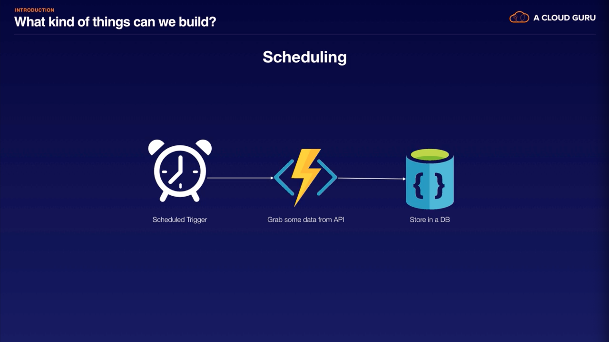
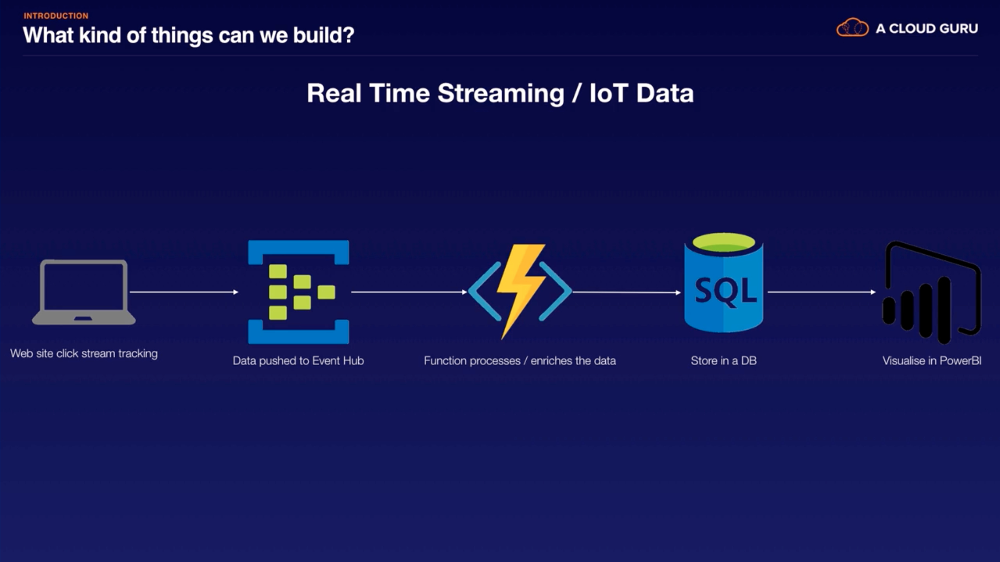
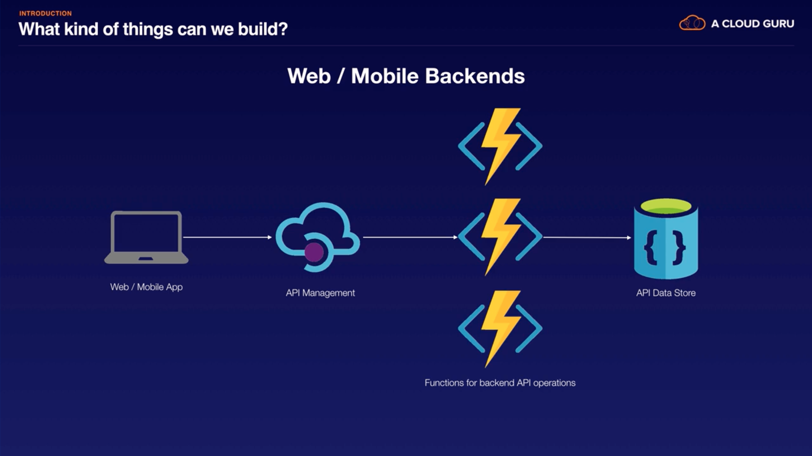
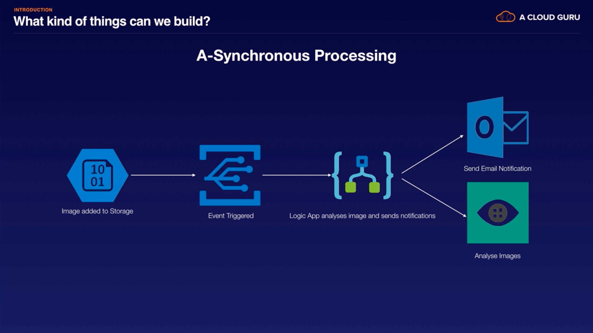
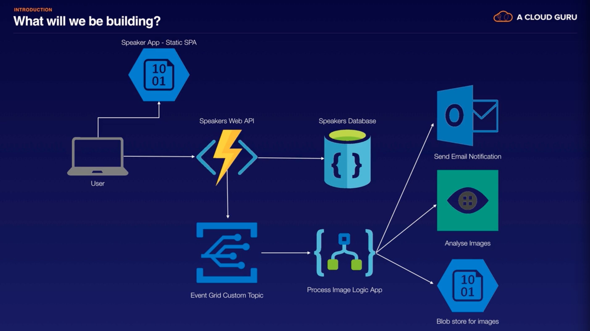

# [Introduction to Serverless on Azure](https://acloud.guru/learn/azure-intro-serverless) (A Cloud Guru, Dean Bryen)

## Introduction

### [Introduction](https://acloud.guru/course/azure-intro-serverless/learn/11f9f04a-c8a8-b34d-e1db-851947d532c6/c13aaace-f3a0-1719-22a3-0bbe9ad04f17/watch)

### [What is Serverless?](https://acloud.guru/course/azure-intro-serverless/learn/11f9f04a-c8a8-b34d-e1db-851947d532c6/ed45fec6-7496-86f6-2d19-db8adf56ba97/watch)

- What is Serverless?
  - Event-based
  - Managed/scalable
  - Pay per use
- Serverless services
  - Comprised of the services that meet the 3 characteristics above.
- Serverless patterns
  - Comprised of both truly serverless services adn complimentary managed services to make 'serverless apps'.

### [Azure Serverless Offering](https://acloud.guru/course/azure-intro-serverless/learn/11f9f04a-c8a8-b34d-e1db-851947d532c6/c7607a4d-cb49-712a-b9c5-9f66337657b3/watch)

- 3 truly serverless Azure services
  - Azure Functions
    - FaaS
  - Event Grid
    - Serverless event router (pub/sub)
  - Logic Apps
    - Graphically design workflows
      - Workflows as a service.
    - Integrate with 3rd party services
- Complimentary services
  - CosmosDB
    - Multi-model, scalable, NoSQL
  - IoT Hub
    - IoT broker for receiving telemetry data from IoT devices
  - Queues
    - Decouple asynchronous services
  - Azure Storage
    - Static content, media assets
  - Event Hubs
    - Managed service for streaming/telemetry data into Azure
  - Azure AD
    - Authentication & authorization

### [Serverless Patterns](https://acloud.guru/course/azure-intro-serverless/learn/11f9f04a-c8a8-b34d-e1db-851947d532c6/3238edf7-8bc1-7de6-62a5-d28f0ff46755/watch)

- 
- 
- 
- 

### [What We're Building](https://acloud.guru/course/azure-intro-serverless/learn/11f9f04a-c8a8-b34d-e1db-851947d532c6/b7625ba2-808f-001a-0907-3665dbc88653/watch)

- 

## Getting Set Up

### [Before We Start](https://acloud.guru/course/azure-intro-serverless/learn/6da8bd80-5988-cd0e-e9d2-4580d1b21ad3/e9076f44-d110-3c6d-02d4-b20e85230a34/watch)

### [Getting Your Azure Account](https://acloud.guru/course/azure-intro-serverless/learn/6da8bd80-5988-cd0e-e9d2-4580d1b21ad3/e8f6cb59-c8a1-a4c0-a526-4f6ab3324882/watch)

- [https://azure.microsoft.com/en-us/free/](https://azure.microsoft.com/en-us/free/)
- Sign up with Microsoft account.
- Sign in at [https://portal.azure.com/](https://portal.azure.com/#home)

### [Installing Node.js and NPM](https://acloud.guru/course/azure-intro-serverless/learn/6da8bd80-5988-cd0e-e9d2-4580d1b21ad3/4da92ede-363a-373a-82c9-bd28d28de738/watch)

- Download LTS from [https://nodejs.org/en/](https://nodejs.org/en/)

### [Azure Functions Core Tools](https://acloud.guru/course/azure-intro-serverless/learn/6da8bd80-5988-cd0e-e9d2-4580d1b21ad3/e31ab6ed-9365-e08c-5b70-2d097862d736/watch)

- .NET Core & Azure Function Core Tools
- [https://docs.microsoft.com/en-us/azure/azure-functions/functions-run-local?tabs=macos%2Ccsharp%2Cbash](https://docs.microsoft.com/en-us/azure/azure-functions/functions-run-local?tabs=macos%2Ccsharp%2Cbash)
  - There are 2 versions. We'll be using version 2.x.
  - Follow steps for macOS
    - Install .NET Core 2.1 for macOS.
      - May be able to use [extension bundles](https://docs.microsoft.com/en-us/azure/azure-functions/functions-bindings-register#extension-bundles) instead?
    - Install Core Tools

```sh
brew tap azure/functions
brew install azure-functions-core-tools
```

### [VSCode and Extensions](https://acloud.guru/course/azure-intro-serverless/learn/6da8bd80-5988-cd0e-e9d2-4580d1b21ad3/7e48fe79-adf9-4fa2-6987-f27f0aec8e29/watch)

- [https://code.visualstudio.com/](https://code.visualstudio.com/)
- Extensions:
  - Azure Functions
    - `ms-azuretools.vscode-azurefunctions`
  - Azure Cosmos DB
    - `ms-azuretools.vscode-cosmosdb`
- Extension are now visible in the Azure side panel.
- Sign in to Azure.

### [Git and GitHub Repo](https://acloud.guru/course/azure-intro-serverless/learn/6da8bd80-5988-cd0e-e9d2-4580d1b21ad3/ac36c399-cad3-e1e1-9e8e-973193edce7e/watch)

- Create repo (or directory): `acloudguru-serverless-azure`

  ```sh
  mkdir acloudguru-serverless-azure
  cd acloudguru-serverless-azure
  ```

## Building a Web API

### [Reminder of What We're Building](https://acloud.guru/course/azure-intro-serverless/learn/f9771d34-046b-7d06-bad0-8d1fe80da26b/d250d155-1797-4f53-468b-226228bd6bf9/watch)

### [Getting the Code from GitHub](https://acloud.guru/course/azure-intro-serverless/learn/f9771d34-046b-7d06-bad0-8d1fe80da26b/fb736801-7aa8-f73c-24e4-c126a5c1c952/watch)

- [https://github.com/acloudguru-resources/Course-Introduction_to_Serverless_on_Azure](https://github.com/acloudguru-resources/Course-Introduction_to_Serverless_on_Azure)
- Copy code for `frontend/index.html` and `frontend/constants.js`:

  ```sh
  mkdir frontend
  touch frontend/index.html
  touch frontend/constants.js
  ```

- Install and run `lite-server`

  ```sh
  npm init
  npm install lite-server
  ```

- Add script to `package.json`: `"dev": "lite-server --baseDir=\"frontend\"",`
- Run `npm run dev`

### [Overview of Azure Functions]()

### [Creating the First Function]()

### [Setting Up our CosmosDB]()

### [Creating the Rest of our API]()

### [Publishing our API to Azure]()

### [Hosting our Static Website]()

## Event Grid

## Logic Apps

## Summary
